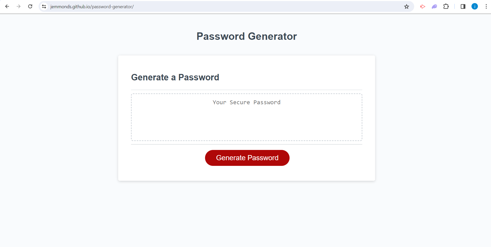
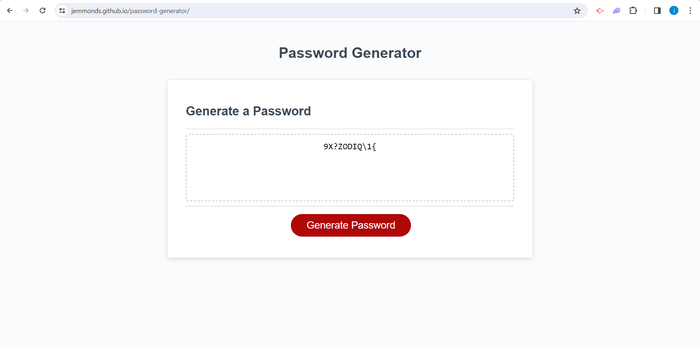

# password-generator

In this challenge I had to create a random password generator. In order to do this I had to prompt the user to select a password length between 8 and 128 characters. Afet that I had to use 'confirm' to allow the user to select what type of characters they wanted to be include in their password eg. lowercase, uppercase, numeric and special characters. After that, using functions and for loops I created a function that generated a random password based on the input from the user. 

